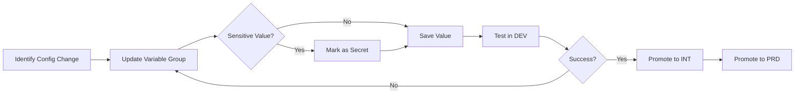

# Configuration Quick Start Guide

## 🚀 5-Minute Setup

This guide will help you set up the centralized configuration for your CI/CD pipeline in under 5 minutes.

---

## Prerequisites

✅ Azure DevOps organization and project created  
✅ Azure CLI installed (`az --version`)  
✅ Azure DevOps CLI extension installed (`az extension add --name azure-devops`)  
✅ Authenticated to Azure DevOps (`az login` and `az devops login`)  
✅ Appropriate permissions in Azure DevOps project

---

## Step 1: Install Azure DevOps CLI (if not already installed)

```bash
# Install Azure CLI (if needed)
curl -sL https://aka.ms/InstallAzureCLIDeb | sudo bash

# Install Azure DevOps extension
az extension add --name azure-devops

# Login
az login
az devops login
```

---

## Step 2: Run the Setup Script

```powershell
# Windows PowerShell
cd cicd/config

.\variable-groups-setup.ps1 `
    -OrganizationUrl "https://dev.azure.com/YOUR_ORG" `
    -ProjectName "YOUR_PROJECT"
```

```bash
# Linux/Mac (if you have PowerShell Core)
pwsh
cd cicd/config

./variable-groups-setup.ps1 `
    -OrganizationUrl "https://dev.azure.com/YOUR_ORG" `
    -ProjectName "YOUR_PROJECT"
```

**What this does:**
- Creates 4 variable groups (vg-shared-config, vg-dev-config, vg-int-config, vg-prd-config)
- Pre-populates with template variables
- Sets up the structure for your CI/CD pipeline

---

## Step 3: Update Variable Values

### Option A: Via Azure DevOps UI (Recommended for First-Time Setup)

1. Navigate to **Azure DevOps** → **Pipelines** → **Library**
2. You'll see 4 variable groups created
3. Open each group and update the placeholder values:

#### vg-shared-config
```
AZURE_SUBSCRIPTION_ID  = <Your Azure Subscription ID>
AZURE_LOCATION         = eastus (or your preferred region)
AZURE_TENANT_ID        = <Your Azure AD Tenant ID>
TF_STATE_STORAGE_ACCOUNT = <Your Terraform state storage account>
```

#### vg-dev-config
```
devServiceConnection         = <Your DEV service connection name>
devResourceGroup            = rg-dataeng-dev (or your naming convention)
DEV_ADF_NAME                = adf-dataeng-dev
DEV_DATABRICKS_HOST         = https://adb-xxxxx.azuredatabricks.net
DEV_SQL_SERVER              = sql-dataeng-dev.database.windows.net
DEV_STORAGE_ACCOUNT         = stdataengdev
DEV_KEY_VAULT_NAME          = kv-dataeng-dev
```

#### vg-int-config
```
(Same structure as dev, but with INT values)
```

#### vg-prd-config
```
(Same structure as dev, but with PRD values)
```

### Option B: Bulk Update via Script

Create a file `update-variables.ps1`:

```powershell
# Set your values
$org = "https://dev.azure.com/YOUR_ORG"
$project = "YOUR_PROJECT"

az devops configure --defaults organization=$org project=$project

# Update shared variables
$sharedGroupId = az pipelines variable-group list --group-name "vg-shared-config" --query "[0].id" -o tsv
az pipelines variable-group variable update --group-id $sharedGroupId --name "AZURE_SUBSCRIPTION_ID" --value "YOUR_SUB_ID"
az pipelines variable-group variable update --group-id $sharedGroupId --name "AZURE_LOCATION" --value "eastus"
# ... continue for other variables
```

---

## Step 4: Create Azure Service Connections

You need to create service connections in Azure DevOps for each environment.

### Via Azure DevOps UI:

1. Go to **Project Settings** → **Service connections**
2. Click **New service connection** → **Azure Resource Manager**
3. Choose **Service principal (automatic)**
4. Select your subscription and resource group
5. Name it according to your variable groups:
   - `azure-dev-service-connection` (for DEV)
   - `azure-int-service-connection` (for INT)
   - `azure-prd-service-connection` (for PRD)
6. Grant access permission to all pipelines (or specific pipelines)

### Via Azure CLI:

```bash
# Create service connection for DEV
az devops service-endpoint azurerm create \
    --azure-rm-service-principal-id <SP_APP_ID> \
    --azure-rm-subscription-id <SUBSCRIPTION_ID> \
    --azure-rm-subscription-name "DEV Subscription" \
    --azure-rm-tenant-id <TENANT_ID> \
    --name "azure-dev-service-connection" \
    --org "https://dev.azure.com/YOUR_ORG" \
    --project "YOUR_PROJECT"

# Repeat for INT and PRD
```

---

## Step 5: Configure Environment Approvals (for PRD)

1. Go to **Pipelines** → **Environments**
2. Create an environment named **PRD**
3. Click **...** (More actions) → **Approvals and checks**
4. Add **Approvals** check
5. Add approvers (users/groups who must approve production deployments)
6. Save

**This ensures manual approval is required before production deployments.**

---

## Step 6: Test the Setup

### Run the pipeline:

```bash
# Trigger a pipeline run
az pipelines run --name "azure-pipelines.yml" --branch dev
```

Or commit and push to the `dev` branch to trigger automatically.

### Verify:

1. Pipeline should start automatically
2. Change Detection stage should identify changed components
3. CI Validation should run
4. Build should create artifacts
5. DEV deployment should proceed with your configured variables

---

## Quick Reference: Where Variables Are Used

| Pipeline Stage | Variable Groups Imported | Purpose |
|----------------|-------------------------|----------|
| Change Detection | None | Detects which files changed |
| CI Validation | None | Validates code quality |
| Build | None | Creates deployment artifacts |
| Deploy DEV | vg-dev-config, vg-shared-config | Deploys to DEV |
| Deploy INT | vg-int-config, vg-shared-config | Deploys to INT |
| Deploy PRD | vg-prd-config, vg-shared-config | Deploys to PRD |

---

## Common Configuration Changes

### Change 1: Update Databricks Workspace URL

```bash
az devops configure --defaults organization="https://dev.azure.com/YOUR_ORG" project="YOUR_PROJECT"

# Update DEV
az pipelines variable-group variable update \
    --group-id $(az pipelines variable-group list --group-name "vg-dev-config" --query "[0].id" -o tsv) \
    --name "DEV_DATABRICKS_HOST" \
    --value "https://adb-NEW-URL.azuredatabricks.net"

# Update INT
az pipelines variable-group variable update \
    --group-id $(az pipelines variable-group list --group-name "vg-int-config" --query "[0].id" -o tsv) \
    --name "INT_DATABRICKS_HOST" \
    --value "https://adb-NEW-URL.azuredatabricks.net"

# Update PRD
az pipelines variable-group variable update \
    --group-id $(az pipelines variable-group list --group-name "vg-prd-config" --query "[0].id" -o tsv) \
    --name "PRD_DATABRICKS_HOST" \
    --value "https://adb-NEW-URL.azuredatabricks.net"
```

### Change 2: Update Azure Region

```bash
az pipelines variable-group variable update \
    --group-id $(az pipelines variable-group list --group-name "vg-shared-config" --query "[0].id" -o tsv) \
    --name "AZURE_LOCATION" \
    --value "westus2"
```

### Change 3: Add a New Variable (All Environments)

```bash
# Add to shared config
az pipelines variable-group variable create \
    --group-id $(az pipelines variable-group list --group-name "vg-shared-config" --query "[0].id" -o tsv) \
    --name "NEW_VARIABLE" \
    --value "VALUE"

# Add to each environment-specific config
for env in dev int prd; do
    az pipelines variable-group variable create \
        --group-id $(az pipelines variable-group list --group-name "vg-${env}-config" --query "[0].id" -o tsv) \
        --name "${env^^}_NEW_VARIABLE" \
        --value "VALUE_FOR_${env^^}"
done
```

---

## 🔒 Security Best Practices

### Mark Sensitive Variables as Secret

In Azure DevOps UI:
1. Open variable group
2. Find the variable (e.g., connection strings, passwords)
3. Click the 🔒 lock icon
4. Variable is now encrypted and hidden

Via CLI:
```bash
az pipelines variable-group variable update \
    --group-id <GROUP_ID> \
    --name "SENSITIVE_VAR" \
    --value "SECRET_VALUE" \
    --secret true
```

### Recommended Secret Variables:
- SQL connection strings
- Storage account keys
- Service principal secrets
- API keys
- Databricks PAT tokens (if used)

---

## Troubleshooting

### Issue: "Variable group not found"

**Solution:**
```bash
# List all variable groups
az pipelines variable-group list --output table

# Verify the group exists and note its ID
```

### Issue: "Permission denied"

**Solution:**
1. Go to Library → Variable Groups → Security
2. Add `[ProjectName] Build Service` with Reader permission
3. Add yourself with Administrator permission

### Issue: "Pipeline fails with 'variable not found'"

**Solution:**
Verify variable group is imported in the pipeline stage:

```yaml
variables:
  - group: vg-dev-config  # Make sure this is present
```

---

## Next Steps

✅ Variable groups created and configured  
✅ Service connections set up  
✅ Environment approvals configured  
✅ Pipeline tested  

**Now you can:**

1. **Deploy to DEV** - Push to `dev` branch
2. **Deploy to INT** - Push to `int` branch or merge from `dev`
3. **Deploy to PRD** - Create a `release/*` branch and merge

---

## Configuration Update Workflow



---

## Support

For questions or issues:

1. Check [VARIABLES_REFERENCE.md](VARIABLES_REFERENCE.md) for complete variable documentation
2. Review [Azure DevOps Pipeline Logs](https://dev.azure.com)
3. Contact DevOps Team

---

**Setup Complete! 🎉**

You now have a centralized, maintainable configuration system for your CI/CD pipeline.